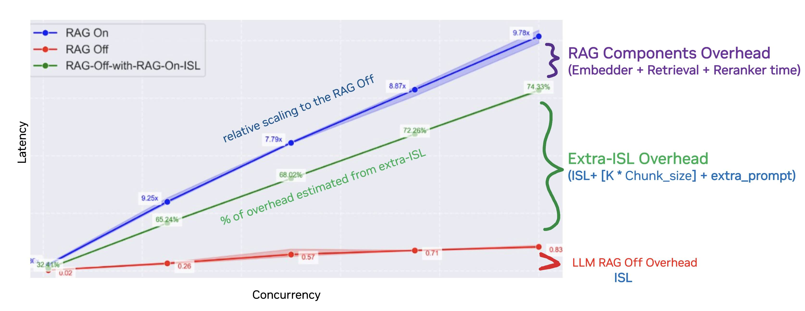

## Overview 
This recipe contains information and scripts to benchmark the speed performance of NVIDIA's [Enterprise RAG Blueprint](https://build.nvidia.com/nvidia/build-an-enterprise-rag-pipeline). This assumes you have already successfully deployed the [RAG Blueprint](https://github.com/NVIDIA-AI-Blueprints/rag) in a K8s cluster and your service is ready to receive requests. 

The scripts will launch a Kubernetes pod in the namespace of your deployed RAG pipeline and send requests to both the RAG service as well as directly to the LLM to gather latency and throughput metrics with a real-time inference use case across concurrency levels.

GenAI-Perf tool is used generate the requests and capture the metrics: [First Token Latency (FTL), Inter-Token Latency (ITL), Request Latency, Request Throughput, and Token Throughput metrics](https://docs.nvidia.com/nim/benchmarking/llm/latest/metrics.html).

For real-time inference we typically focus on FTL and ITL as they define the user experience. Offline or batch inference would typically focus on throughput metrics.

## Prerequisites
- You will need the `service:port` of both your RAG service and LLM deployed in the RAG Pipeline
- You will need the Kubernetes `namespace` in which your RAG pipeline is deployed
- `NGC_API_KEY` ([NGC Registry](https://org.ngc.nvidia.com/setup) for access) which provides access  to the following container:
   -  `nvcr.io/nvidia/tritonserver:<year>.<month>-py3-sdk`
      - Find the latest `py3-sdk` tag in the [Triton Inference Server page](https://catalog.ngc.nvidia.com/orgs/nvidia/containers/tritonserver/tags) of the NGC catalog. Only the `-sdk` tags have GenAI-Perf which is required for benchmarking.
- `HF_TOKEN` ([HuggingFace](https://huggingface.co/settings/tokens) for access)
    - Access to Llama 3.x must be requested through [Meta's website](https://llama.meta.com/llama-downloads/) then requested on the [HuggingFace Llama](https://huggingface.co/meta-llama/Meta-Llama-3.1-405B) page. The approval process is not automatic and could take a day or more.


## Example RAG Blueprint Configurations
### Balanced speed/accuracy: Llama3 70B, Reranker 4, Chat Use Case

#### RAG Deployemnt Setup:
- GPU components: 5x H100 80GB:
    - NeMo Retriever Llama 3.2 Embedding NIM (1 GPU)
    - NeMo Retriever Llama 3.2 Reranking NIM (1 GPU)
        - Reranker-K=4
    - Llama 3.1 70B Instruct NIM (2 GPUs)
        - FP8, TP=2
    - Milvus Vector database (accelerated with NVIDIA cuVS) (1 GPU)
        - Cluster Mode
        - 50k Vectors
        - VDB-K=20
        - chunking_size=2000 characters --> ~420 tokens per chunk
- CPU:
    - LangChain
- Input/Output sizes:
    - Request Size - What a user requests and receives
        - Chat Use Case : ISL/OSL=128/128
    - RAG_ISL - What the LLM processes
        - ([Reranker-K * chunk_size] + prompting + request-ISL) = ([4 * 420] + 101 + 128 )= 1909 


---
### Speed Optimized: Llama3 8B, No Reranker, Chat Use Case

#### RAG Deployemnt Setup:

- GPU components: 3x H100 80GB:
    - NeMo Retriever Llama 3.2 Embedding NIM (1 GPU)
    - Llama 3.1 8B Instruct NIM (1 GPU)
        - FP8, TP=1
    - Milvus Vector database (accelerated with NVIDIA cuVS) (1 GPU)
        - Cluster Mode
        - 50k Vectors
        - VDB-K=20
        - chunking_size=2000 characters --> ~420 tokens per chunk
- CPU:
    - LangChain
- Input/Output sizes:
    - Request Size - What a user requests and receives
        - Chat Use Case : ISL/OSL=128/128
    - RAG_ISL - What the LLM processes
        - ([VDB-K * chunk_size] + prompting + request-ISL) = ([4 * 420] + 101 + 128 )= 1909 


## Benchmarking Steps on Kubernetes
1. Set your default namespace to the one in which your RAG pipeline is deployed
    ```
    kubectl config set-context --current --namespace=<rag-pipeline-namespace>
    ```

1. Start a pod on your Kubernetes cluster where your RAG pipeline is deployed using the latest [triton container](https://catalog.ngc.nvidia.com/orgs/nvidia/containers/tritonserver/tags) with `py3-sdk` tag
- The pod name here is `benchmark`, but the pod name can be whatever you want

    ```
    kubectl run benchmark --image=nvcr.io/nvidia/tritonserver:<year>.<month>-py3-sdk --command -- sleep 100000
    ```
2. Update the `speed-config.sh` 
    
    Add in your RAG service and LLM (NON-RAG) service and port as defined in your RAG deployment

    ```
    export RAG_SERVICE="" # <service-name>:<port> 
    export NON_RAG_SERVICE="" # <service-name>:<port>
    ```

    Update the NIM model and tokenizer (only if you are using a model different than llama3.1 70B Instruct)
    ```
    export NIM_MODEL_NAME="meta/llama-3.1-70b-instruct"
    export NIM_MODEL_NAME_cleaned="meta-llama-3.1-70b-instruct"
    export NIM_MODEL_TOKENIZER="meta-llama/Meta-Llama-3-70B-Instruct"
    ```

    Update the namespace you are using in your Vector DB.
    Update the # of tokens per chunk_size (determined in ingestion phase) and # of tokens in the system prompt
    ```
    export NAMESPACE="wikipedia" # Vector database namespace
    export CHUNK_SIZE=420 # Number of tokens
    export RAG_PROMPT_EXTRA=100 # Number of Tokens
    ```

    The default values for the VDB_K and Reranker_K values are 20 and 4 respectively
    (20 chunks are retrieved from the VDB and the Reranker ranks and filters to 4)
    If you changed these values in your deployment, adjust them here too.
    ```
    export VDB_and_RERANKER_K="20/4"
    ```

    Lastly update the metadata about the experiment you are running and where to save output files
    - These are only used in the output file names
    ```
    export GPU="H100"
    export CLUSTER="My-Cluster"
    export EXPERIMENT_NAME="RAG-Blueprint"
    export OUTPUT="/tmp/output/"
    ```

3. Copy `sweep-speed.sh` and `speed-config.sh` script into the pod 
    ```
    kubectl cp sweep-speed.sh benchmark:sweep-speed.sh
    kubectl cp speed-config.yaml benchmark:speed-config.yaml
    ```
3.  Enter the pod
    ```
    kubectl exec --stdin --tty benchmark -- /bin/bash
    ```
    - remaining steps will be executed from within the pod
4. Install and login to HuggingFace for the Tokenizer access using [HF_TOKEN](https://huggingface.co/settings/tokens) (optional if not using a tokenizer that requires HF access)

    ```
    pip install -U "huggingface_hub[cli]"
    export HF_TOKEN=<hf-token>
    huggingface-cli login --token $HF_TOKEN
    ```

5. Run sweeper
    ```
    . ./sweep-speed.sh
    ```

    Example output
    ```
    Total experiments to run: 45
    [2025-02-28 05:10:30] Starting experiment: RAG-Off_CR:1_UseCase:chat_ISL:128_OSL:128_Model:meta-llama-3.1-70b-instruct_Cluster:_GPU:H100_Experiment:RAG-Blueprint_2025-02-28_05:10:30.883
    genai-perf profile   -m meta/llama-3.1-70b-instruct   --endpoint-type chat   --service-kind openai   --streaming -u $SERVICE   --num-prompts $total_requests   --synthetic-input-tokens-mean $Request_ISL   --synthetic-input-tokens-stddev 0   --concurrency $CR   $NAMESPACE_PARAM   --output-tokens-mean $OSL   --extra-inputs max_tokens:$OSL   --extra-inputs min_tokens:$OSL   --extra-inputs ignore_eos:true   --artifact-dir /tmp/output//$EXPORT_FILE   --tokenizer meta-llama/Meta-Llama-3-70B-Instruct   -- -v --max-threads=$CR --request-count $total_requests


    ...

    ┏━━━━━━━━━━━━━━━━━━━━━━━━━━━━━━━━━━━┳━━━━━━━━━━┳━━━━━━━━━━┳━━━━━━━━━━┳━━━━━━━━━━┳━━━━━━━━━━┳━━━━━━━━━━┓
    ┃                         Statistic ┃      avg ┃      min ┃      max ┃      p99 ┃      p90 ┃      p75 ┃
    ┡━━━━━━━━━━━━━━━━━━━━━━━━━━━━━━━━━━━╇━━━━━━━━━━╇━━━━━━━━━━╇━━━━━━━━━━╇━━━━━━━━━━╇━━━━━━━━━━╇━━━━━━━━━━┩
    │          Time To First Token (ms) │    59.16 │    58.37 │    71.83 │    65.92 │    59.41 │    59.14 │
    │         Time To Second Token (ms) │    26.14 │    25.64 │    27.17 │    26.73 │    26.24 │    26.20 │
    │              Request Latency (ms) │ 3,397.78 │ 3,370.49 │ 3,416.71 │ 3,408.67 │ 3,399.19 │ 3,398.49 │
    │          Inter Token Latency (ms) │    26.34 │    25.70 │    27.38 │    27.27 │    26.50 │    26.30 │
    │   Output Sequence Length (tokens) │   127.74 │   123.00 │   131.00 │   129.53 │   128.00 │   128.00 │
    │    Input Sequence Length (tokens) │   128.00 │   128.00 │   128.00 │   128.00 │   128.00 │   128.00 │
    │ Output Token Throughput (per sec) │    37.59 │      N/A │      N/A │      N/A │      N/A │      N/A │
    │      Request Throughput (per sec) │     0.29 │      N/A │      N/A │      N/A │      N/A │      N/A │
    │             Request Count (count) │    50.00 │      N/A │      N/A │      N/A │      N/A │      N/A │
    └───────────────────────────────────┴──────────┴──────────┴──────────┴──────────┴──────────┴──────────┘
    Progress: 1 / 45 completed.
    ```

6. See the results in the output
    - default value in speed-config: `export OUTPUT="/tmp/output/"`
    ```
    ls /tmp/output/
    ```
    ```
    RAG-Off_CR:1_UseCase:chat_ISL:128_OSL:128_Model:meta-llama-3.1-70b-instruct_Cluster:_GPU:H100_Experiment:RAG-Blueprint_2025-02-28_05:10:30.883
    RAG-On_CHUNK-SIZE:420_SYS-PROMPT-SIZE:100_VDB-K:20_RERANKER-K:4_CR:1_UseCase:chat_ISL:128_OSL:128_Model:meta-llama-3.1-70b-instruct_Cluster:_GPU:H100_Experiment:RAG-Blueprint_2025-02-28_05:14:24.628
    ....
    ```

    Find the output CSV per experiment directory:
    ```
    /tmp/output/RAG-Off_CR:1_UseCase:chat_ISL:128_OSL:128_Model:meta-llama-3.1-70b-instruct_Cluster:_GPU:H100_Experiment:RAG-Blueprint_2025-02-28_05:10:30.883/profile_export_genai_perf.csv
    ```

    ### Output

    Example output of a CSV.

    ex. 
    ```
    Metric,avg,min,max,p99,p95,p90,p75,p50,p25
    Time To First Token (ms),23.94,22.92,30.75,30.10,27.51,24.26,23.38,23.20,23.02
    Inter Token Latency (ms),11.54,11.45,11.70,11.69,11.64,11.58,11.55,11.53,11.52
    Request Latency (ms),"5,919.16","5,912.73","5,934.45","5,933.31","5,928.74","5,923.03","5,920.17","5,918.56","5,915.29"
    Output Sequence Length,511.90,505.00,516.00,515.91,515.55,515.10,512.75,512.00,511.25
    Input Sequence Length,127.50,126.00,128.00,128.00,128.00,128.00,128.00,128.00,127.00

    Metric,Value
    Output Token Throughput (per sec),86.48
    Request Throughput (per sec),0.17

    ```

## Benchmarking Methodology and Configurations

`sweep-speed.sh` runs a sweep over various parameters:
 - `ISL/OSL` - Input Sequence Length / Output Sequence Length
 - `Concurrency` - # of requests in flight at any given time
 - `VDB_K` - # of chunks to retrieve from the Vector Database
 - `Reranker_K` - # of chunks the Reranker will rank and filter
 
 It runs at least three GenAI Perf commands using each combination of ISL/OSL/Concurrency above:
 1. `RAG Off` - Just sending request to the LLM by itself
 2. `RAG Off with extra ISL` - Just sending request to the LLM by itself with the approximated extra tokens that the RAG context vectors + system prompting add to the input sequence length
 3. `RAG On` - Send the request to the full RAG service


* `RAG On` and `RAG Off with extra ISL` have additional GenAI Perf commands depending on the combination of K Chunks requested. RAG Blueprint defaults to 
    - Example: `ISL=128`, `OSL=512`, `Concurrency=1`, `VDB_K="1 5 10"`

    | Type                   | Combination                             | # of GenAI Perf Commands |
    |------------------------|-----------------------------------------|--------------------------|
    | RAG Off               | (128,512,1,null)                          | 1                        |
    | RAG Off with extra ISL | (128,512,1,1), (128,512,1,5), (128,512,1,10) | 3                        |
    | RAG On                | (128,512,1,1), (128,512,1,5), (128,512,1,10) | 3                        |
    
    * For a total of 7 GenAI Perf output CSVs.

## Interpreting Results



The red line indicates how fast we can process user requests with no extra context.
The green line indicates how fast we can process user requests with the extra context (assuming we got that extra context with no additional overhead).
The blue line represents our normal RAG pipeline.

- The overhead is additive between these lines → Improve a lower line, the lines above improve
- We can only reduce the red line by switching to a faster model or adding more LLM instances
- We can only reduce the green line by improving the red line OR decreasing the size of the extra context (probably at the cost of some accuracy)
- We can only reduce the blue line by improving the green line OR improving the speed of our RAG components.

The most impactful parameters of your pipeline will be the relationship between chunk_size, VDB-K and Reranker-K in terms of speed and accuracy. The LLM is likely the largest bottleneck but those parameters will impact how much your LLM will actually need to process at any point in time. Reducing those three parameters will speed things up but there is a speed/accuracy tradeoff.

Defining the latency constraints your users will expect will help you tune your pipeline while balancing speed and performance tradeoffs. Remember that no one likes a slow service, but no one will use your service if you are providing poor results.


## [Metrics](https://docs.nvidia.com/nim/benchmarking/llm/latest/metrics.html):

| Metric                        | Perspective | Measurement | Description                                                    | Notes                                                                                                   |
|-------------------------------|-------------|-------------|----------------------------------------------------------------|---------------------------------------------------------------------------------------------------------|
| First Token Latency (FTL)     | User        | p95         | How long until I get my first token                           | Example goal/constraint: < 1 second. Responsiveness of the service – critical for interactive applications. Highly dependent on ISL and the number/size of context vectors added to the ISL.  |
| Inter Token Latency (ITL)     | User        | p95         | How long do I wait between tokens                             | Example goal/constraint: ex. < 100ms. 100 ms ~= 450 words per minute per user, faster than a typical person can read. "Fast enough" is good enough in many use cases. This constraint might be much lower for use cases such as code generation |
| Request Latency (end-to-end)  | User        | p95         | How long until I get my final token                           | If I just want to copy/paste a summary or code generation, then I only care about when I get my last token. e2e latency = FTL + ((OSL -1) * ITL). |
| Tokens Throughput (token/sec) | Service     | Average     | How many tokens is the service outputting per second          |  This metric can be misleading since it ignores the user experience waiting for tokens |
| Request Throughput (req/sec)  | Service     | Average     | How many requests is the service outputting per second        | This metric can be misleading since it ignores the user experience waiting for tokens |
## Notes:
- Inference use cases like chat, summarization and analysis are categorized by the typical size of requests and responses - measured in tokens. Input sequence length (**ISL**) and output sequence length (**OSL**) combinations will be used to define those use cases. For example, a chat application might expect short ISL/OSL such as 128/128 whereas summarization is reflected better by 2048/512.

- Concurrency is the number of parallel requests that your service is actively handling at the same time for a sustained period of time - it is not a one-time batch size. This more accuractely reflects the real needs of a real-time inference service.

- The default use cases and concurrency numbers are examples and it is recommended to adjust them to reflect your expected business needs.
- `CHUNK_SIZE` is the approximated size of the chunks of data received from the VDB. It is measured in tokens.
    - This is dependent on the question that is asked and VDB used.​ When using Wikipedia VDB with a chunking_size of 2000 characters, the randomly generated synthetic data questions resulted in an average of 420 tokens per chunk.
    - You will need to calculate this for your setup for the `RAG Off with extra ISL` to accurately represent the REAL chunk_size seen in the `RAG On` scenario
- `RAG_PROMPT_EXTRA` is the approximated extra tokens being added to a user's prompt in a RAG system often called the system prompt. This is only used for `RAG Off with extra ISL` to accurately represent the REAL extra prompting seen in the `RAG On` scenario

